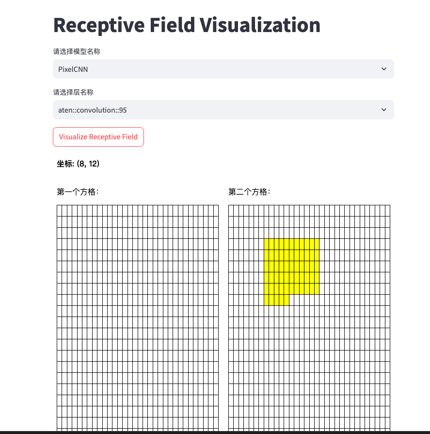

# CNN-Receptive-Field-Visualization
<h4 align="center">
  <p style="text-align: center;">
  <b> English</b> | <a href="README_zh.md">中文文档</a>
  </p>
</h4>

<p align="center">

**感受野可视化工具： 使卷积神经网络（CNN）模型的感受野更加清晰。它有助于设计您自己的模型架构。**

## 支持模型列表
✅ resnet18

✅ pixelcnn

✅ toy models (SimpleCNN && SimpleStrideCNN)

⏳ MobileNet [TODO]

## 快速开始

### 使用方法
```shell
git clone https://github.com/Phi-C/CNN-Receptive-Field-Visualization.git
pip install -r requirements.txt

cd cnnrfvis

# Trace your model and save receptive field info
python save_model_layers.py models/PixelCNN.py

# Visualize receptive fields
streamlit run web.py 
```
### 自定义模型可视化
如果您想可视化自己的视觉模型，请按照以下步骤操作：

1. 将您的模型架构代码放入`cnnrfvis/models/{model_name}.py`文件中。

2. 在`cnnrfvis/models/{model_name}.py`文件中添加`get_{model_name}_rf_info`函数。

3. 在`save_model_layers.py`文件中添加`from cnnrfvis.models.{model_name} import get_{model_name}_rf_info`


## 可视化样例
以 PixelCNN 为例，运行 streamlit run web.py 后，您将被引导至一个网页。

1. 选择您感兴趣的层。

2. 点击 Visualize Receptive Field（可视化感受野）按钮。

3. 将鼠标悬停在特征图（左侧）的某个像素上。

随后，您将在输入图像上看到相应的感受野。


